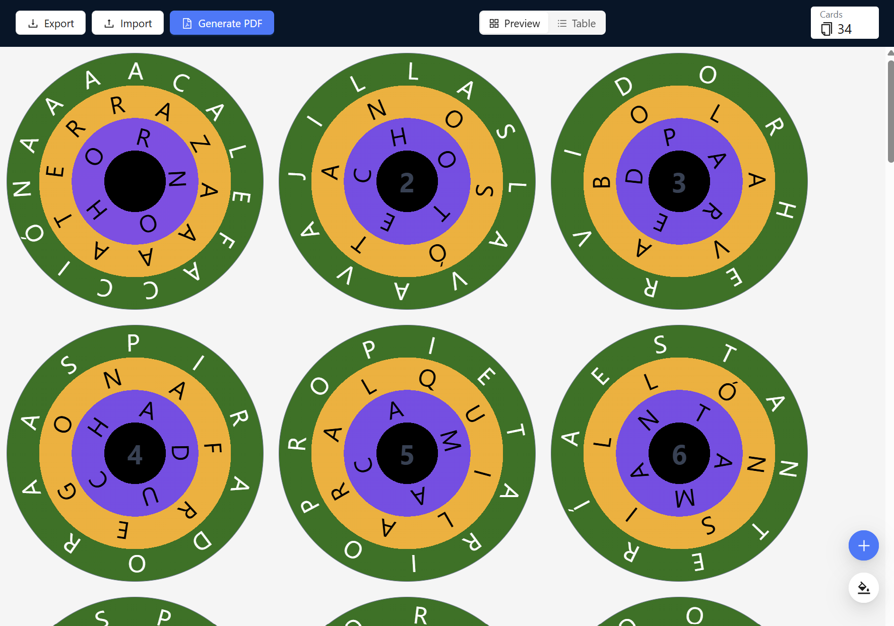

# React app to generate circular cards similar to the game Word A Round

## The reason of this project
My wife is a language teacher and she liked the idea to use this game as a way to make their students memorize words and increase their vocabulary.

## Usage

The latest version of this webapp is published using Github actions at [dzegarra.github.io/letra-a-letra/](https://dzegarra.github.io/letra-a-letra/).

### Instructions

> The web app remembers the active project between refreshes. For this reason you can only work on a single project at any given time.

- Press the Add Card button to keep adding more cards to the end of the stack.
- Hover the center of the card to see the button to change the word or delete the card.
- Use the buttons Export and Import to download and restore your project into or from a file.
- Once you finish, press the Print button to send it to your printed or store it as PDF.

