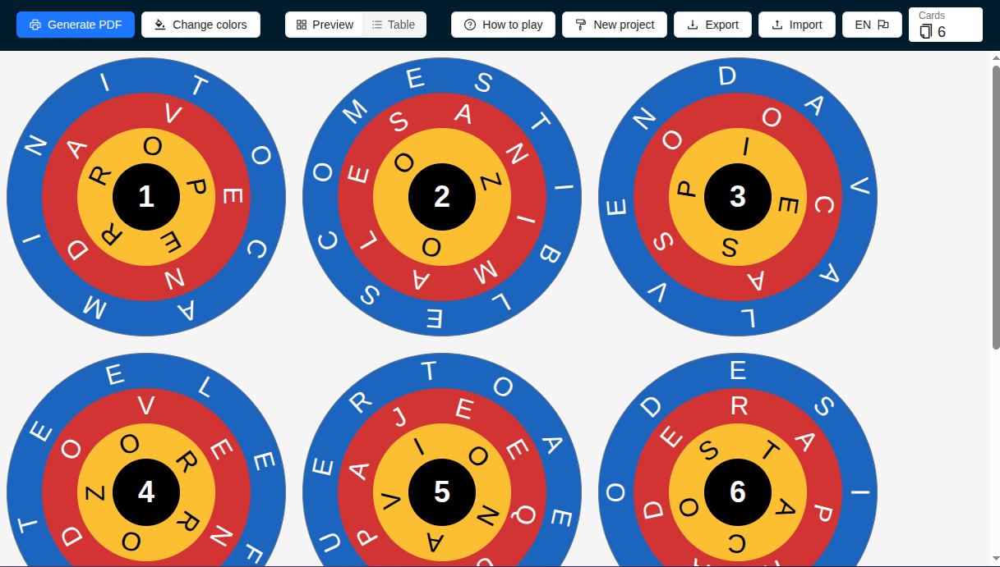

# Create printable circular cards based on the game Word A Round

## The reason of this project
My wife is a language teacher and she liked the idea to use this game as a way to make their students memorize words and increase their vocabulary.

## Use it!

The latest version of this webapp is published using Github actions at [dzegarra.github.io/letra-a-letra/](https://dzegarra.github.io/letra-a-letra/).

## Main features

- You can choose 3 words per card
- The colors are customizable
- Two modes to input or change words: Preview and Table
- Export and import projects
- Remembers the last project
- Generates a PDF document ready to be use
- If you have a duplex printer, you can choose interleave the pages to save time
- Can be installed as an app (PWA) in your desktop or phone to work offline

### Instructions

#### How to create a deck

> The web app remembers the active project between refreshes. For this reason you can only work on a single project at any given time.

1. Write three words on each card, for example the vocabulary of the lesson, and print the PDF. 
2. Cut out the cards and glue each one to its back. Laminating them is recommended, so they don't bend or get damaged while playing.

#### How to play in the classroom

1. Shuffle the cards and put them face up in a pile in the middle. Before starting, the players choose the color of the ring to read on the first card.
2. Everyone looks at the same time for the word in that ring: its letters go one after another, without spaces, clockwise, starting anywhere on the ring.
3. Whoever says the word first takes the card. The color on its back tells which ring to read on the next card.
4. If two or more players say it at the same time, the card is set aside and only they play for the next one. The winner takes both.
5. When the pile runs out, the player with the most cards wins.

